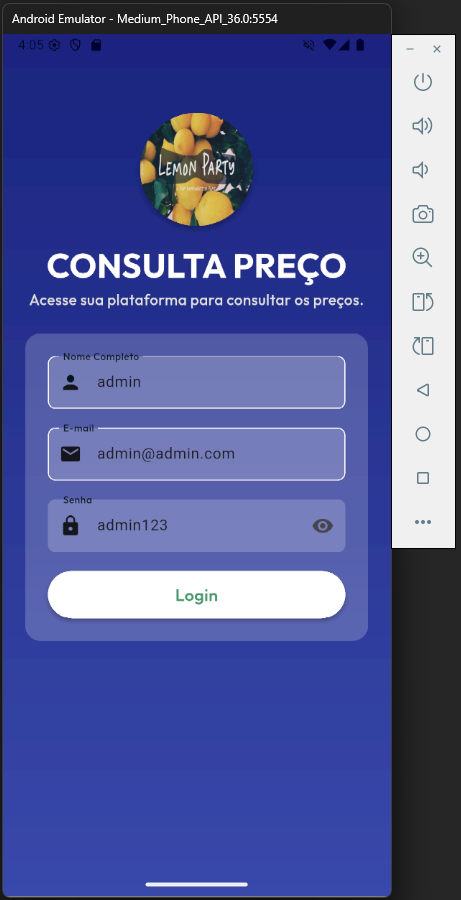
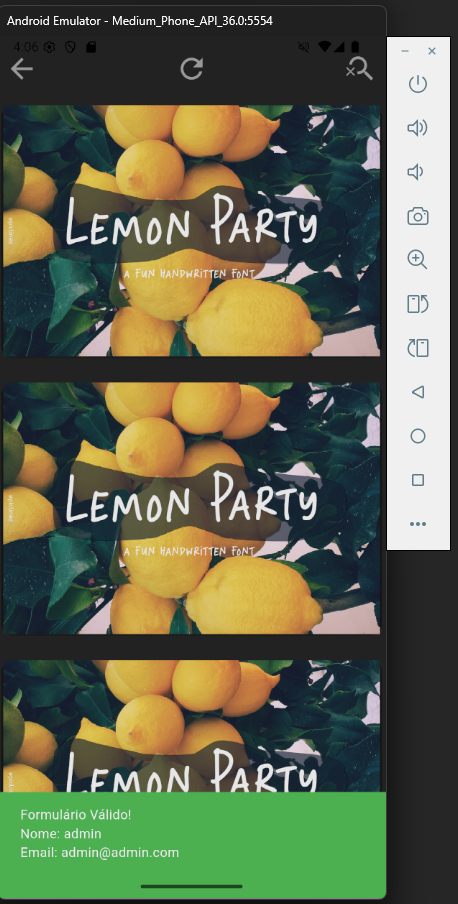
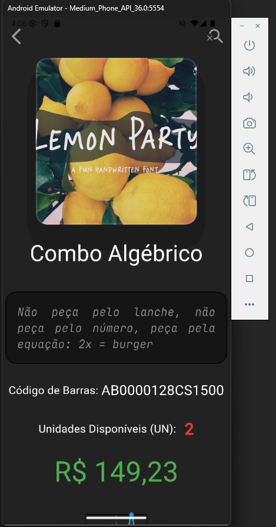
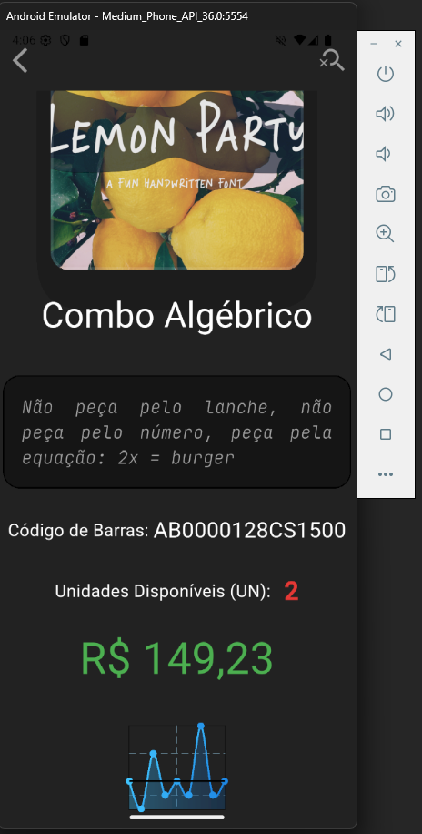

# Visualiza Preço - Flutter

Um projeto em Dart, utilizando o Framework Flutter, de consulta de preços de produtos em uma determinada loja. Aplicativo foi feito como entrega semestral da disciplina de Desenvolvimento de Sistemas Web Mobile IV.

## Como Rodar o Código?

Como esse é o código-fonte, é necessário haver previamente as extensões de Dart e Flutter do VSCode ou o Android Studio configurado. Feito isso, deve-se executar o comando ``flutter pub get`` no terminal e aguardar a instalação das dependências.

Para executar, basta utilizar o comando ``flutter run -d windows``, ou somente ``flutter run``, se deseja escolher o ambiente de emulação.

## Entregas

### Tela de Login

É neste momento que o usuário poderá fazer login ou registro dentro do aplicativo. Abaixo, uma demonstração inicial da tela de login, conta também com validação básica de e-mail e senha.

  

### Tela de Dashboard

É na tela de dashboard que usuário terá controle do aplicativo, podendo alternar entre produtos ou funcionalidades. Abaixo, uma imagem que demonstra inicialmente a estrutura básica sem menus dos produtos.

  

### Tela de Produto

Na tela de produto, contaremos com as informações completas de um determinado item no estoque, contando com preços atuais, estoque disponível, descrições e gráficos de histórico. Abaixo, uma imagem que demonstra inicialmente essa funcionalidade.

  
  

