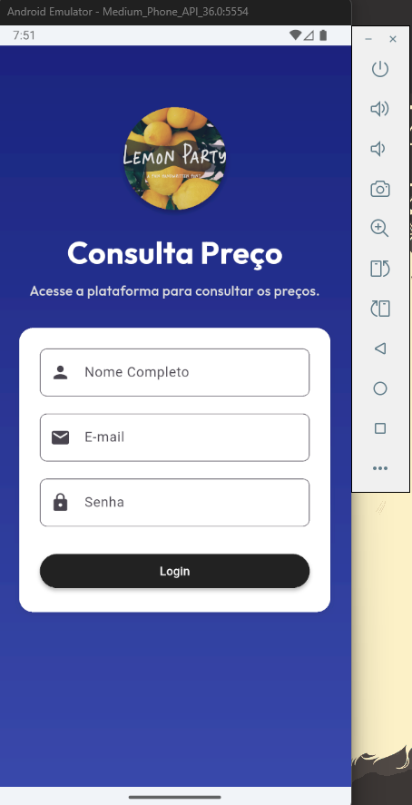
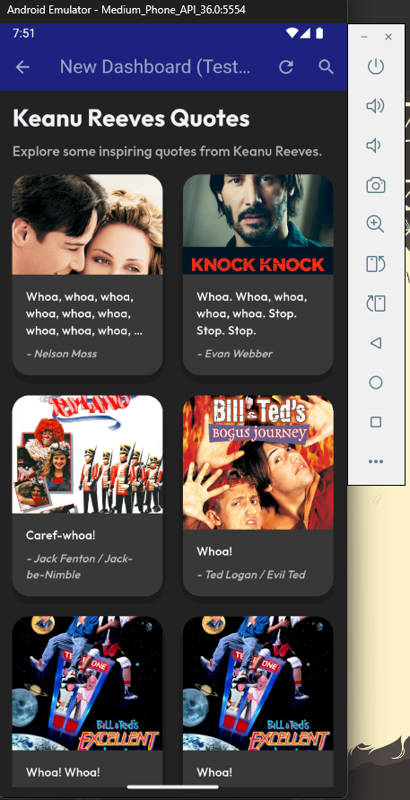
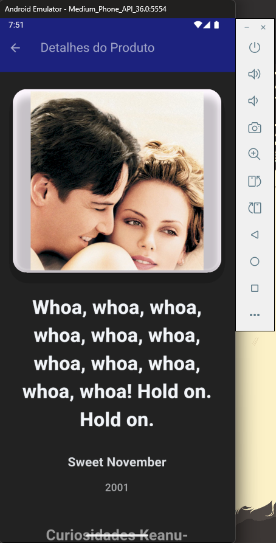
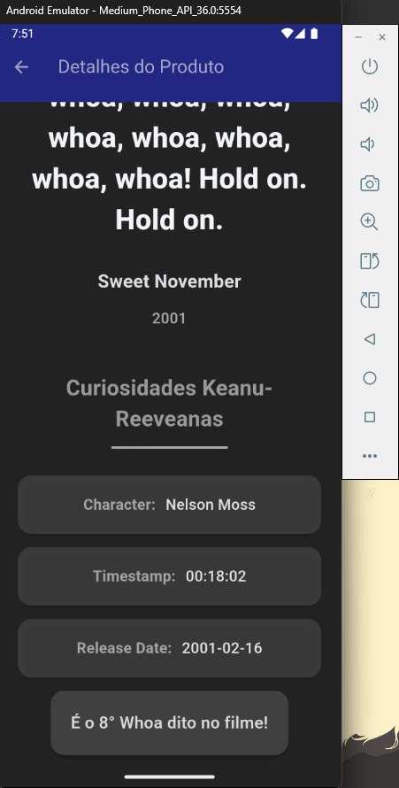

# Visualiza Preço - Flutter

Um projeto em Dart, utilizando o Framework Flutter, de consulta de preços de produtos em uma determinada loja. Aplicativo foi feito como entrega semestral da disciplina de Desenvolvimento de Sistemas Web Mobile IV.

## Como Rodar o Código?

Como esse é o código-fonte, é necessário haver previamente as extensões de Dart e Flutter do VSCode ou o Android Studio configurado. Feito isso, deve-se executar o comando ``flutter pub get`` no terminal e aguardar a instalação das dependências.

Para executar, basta utilizar o comando ``flutter run -d windows``, ou somente ``flutter run``, se deseja escolher o ambiente de emulação.

## Atualizações

### Segunda Parte da Entrega (05/09/2025)
Para complementar a construção do aplicativo, utilizamos o modelo Atomic Design que visa atomizar o layout de uma página através de componentes indivisíveis que, juntos, formam outras estruturas mais complexas. As páginas do aplicativo foram substituídas para se encaixar melhor no padrão do Atomic Design.

Similarmente, o uso de comentários mais pertinentes e uma validação de formulários foi implementada nessa segunda etapa.

Além disso, parte do layout foi simplificado para garantir uma melhor fluidez e experiência de usuário.

Concluindo, foi utilizada uma API pública para capturar e tratar os dados dentro do sistema, a fim de treinar e consolidar o aprendizado de sala de aula. O link para a API se encontra em https://whoa.onrender.com/

## Entregas

### Tela de Login

É neste momento que o usuário poderá fazer login ou registro dentro do aplicativo. Abaixo, uma demonstração inicial da tela de login, conta também com validação básica de e-mail e senha.

  

### Tela de Dashboard

É na tela de dashboard que usuário terá controle do aplicativo, podendo alternar entre produtos ou funcionalidades. Abaixo, uma imagem que demonstra inicialmente a estrutura básica sem menus dos produtos.

  

### Tela de Produto

Na tela de produto, contaremos com as informações completas de um determinado item no estoque, contando com preços atuais, estoque disponível, descrições e gráficos de histórico. Abaixo, uma imagem que demonstra inicialmente essa funcionalidade.

Para exemplificar a tela, utilizamos alguns dados da API Woah do Keanu Reeves, abaixo estão elencadas as principais informações utilizadas pelo aplicativo.

  
  

### Primeira Parte da Entrega 2 (07/11/2025)
A primeira parte da entrega do segundo bimestre foi marcada pela refatoração de código. Nós portamos toda a seção de produtos no padrão DDD, ou Domain-Driven Design, para seguir as boas práticas. Além disso, implementamos a busca por código de barras via câmera do dispositivo e também teclado. Entre outras entregas, realizamos toda a portabilidade do gerenciamento de estados com o Provider do Flutter e implementamos testes automatizados de componente/wiget e os testes unitários.
